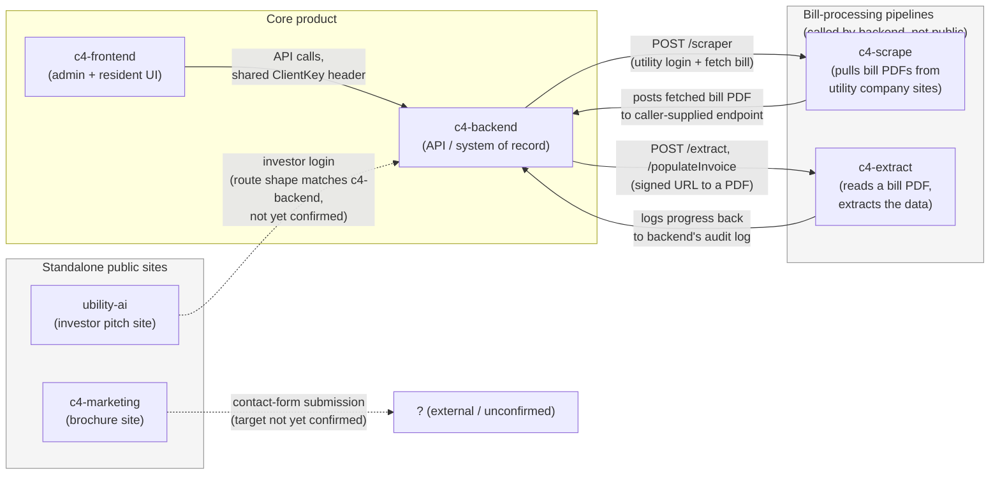
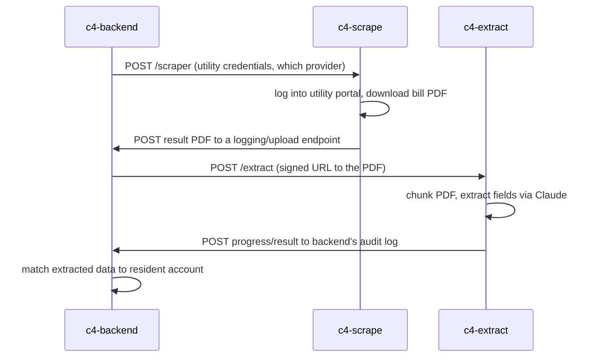

# Ubility / C4Billing — System Architecture Overview

*Purpose: lay out our current understanding of what each of the six repos does and how they connect, so the team that built this can confirm or correct it before we plan any maintenance or development work. This is a map, not an audit — it doesn't cover code quality or security, just what talks to what and why.*

---

## The six repos, at a glance

| Repo | Role | Stack |
|---|---|---|
| `c4-backend` | Core API — billing, invoicing, provider integrations, the system of record | .NET Framework 4.7.2, ASP.NET MVC 5 + Web API 5, SignalR, EF6, SQL Server (AWS RDS) |
| `c4-frontend` | Primary product UI — admin back-office + resident portal | Next.js 14, TypeScript, MUI, Redux Toolkit |
| `c4-scrape` | Fetches utility bills from utility-company websites | Node/TS, Express, Puppeteer (headless Chromium), Cloud Run |
| `c4-extract` | Reads a bill PDF and pulls structured data out of it | Node/TS, Express, Claude (Anthropic), Cloud Run |
| `c4-marketing` | Public brochure/marketing site | Next.js 14, MUI |
| `ubility-ai` | Investor-facing pitch site (two branded copies of one deck) | Vite, React, TypeScript |

Four of these (`c4-backend`, `c4-frontend`, `c4-scrape`, `c4-extract`) form one connected system — the actual product. The other two (`c4-marketing`, `ubility-ai`) are standalone public websites with no meaningful tie back into that system.

---

## System map

**Solid arrows** are mechanisms we found concretely in the code (a specific endpoint, a specific config value). **Dotted arrows** are things we can see being called from one side but haven't confirmed land where we think on the other side — flagged below as questions for the team.

---

## Per-repo detail

### c4-backend — the core
The system of record. Owns residents, properties, invoices, payables, tickets, meter data, and the integrations with Yardi, RealPage, Entrata, RentManager, Bill.com, Forte, QuickBooks, and Stripe. Everything else in the product exists to feed data into or read data out of this repo. Business rules are implemented heavily as SQL stored procedures rather than in application code.

### c4-frontend — the UI
The interface staff and residents actually use — admin back-office (billing, property management, provider integrations, collections) plus a resident-facing portal (bill pay, statements). All product functionality is a thin client over `c4-backend`'s API, authenticated with a shared key sent on every request.

### c4-scrape — bill retrieval
A small service whose only job is logging into a utility company's own customer portal (Rocky Mountain Power, Dominion Energy, Salt Lake City Public Utilities, Republic Services, and a partial Duke Energy integration) with credentials supplied per-request, and downloading the bill PDF. Called synchronously — something on the backend side kicks off a scrape and waits for the result, rather than this running on its own schedule.

### c4-extract — bill reading
Takes a bill PDF (already fetched — likely by `c4-scrape`, though the direct caller isn't confirmed) and uses Claude to pull structured data out of it: account numbers, charges, dates. Matches the result to a Ubility account and reports back to the backend's own logging system as it works.

### c4-marketing — brochure site
Public-facing marketing pages (home, about, solutions, contact, get-started). No login, no CMS. The only outbound call is a "request information" contact form.

### ubility-ai — investor site
Despite the name, this isn't an AI service — it's a second public site, a pitch deck for investors, built as two access-gated copies of the same content for two different audiences. It has a login flow for investor access, pointed at a configurable API base URL that isn't hosted in this repo.

---

## The bill-processing flow (the one pipeline worth diagramming precisely)

This is our best reconstruction of how a bill actually moves through the system, based on what each repo calls and receives. Worth the team confirming this is actually the sequence, since we're inferring the caller/trigger from the receiving side in a couple of spots.

---

## Open questions for the team

A few things we couldn't fully confirm just by reading the code, and would rather ask than assume:

1. **What actually triggers a scrape?** Is `c4-backend` calling `c4-scrape` on a schedule, on-demand when a resident's bill is due, or from somewhere else entirely (a queue, a timer job) that isn't visible in either repo?
2. **Does anything besides `c4-backend` call `c4-extract`?** Or is the backend the only caller?
3. **Where does `c4-marketing`'s contact form actually go?** CRM, email, a Ubility-internal endpoint, something else?
4. **Does `ubility-ai`'s investor login actually hit `c4-backend`?** The route shape (`/API/UserAuth/InvestorLogin`) looks like it belongs to the same ASP.NET API, but we haven't confirmed the two repos are actually pointed at each other in a live environment.
5. **Are there any other consumers of `c4-backend`'s API** we wouldn't see just by reading these six repos — a mobile app, a partner integration, anything not in this list?

---

## Why this matters for scaling

The dependency shape is simple and mostly linear: `c4-frontend` and the two pipeline services (`c4-scrape`, `c4-extract`) all funnel through `c4-backend`, and `c4-backend` is a single .NET application on a Windows VM backed by one SQL Server instance. That's the real constraint on scaling this platform — not the number of repos (six is a manageable footprint) but the fact that the core product is one backend service with no way to scale it horizontally as-is, plus business logic embedded in stored procedures that only exist in the live database rather than in version control. Any conversation about "scaling this thing" is really a conversation about that one repo.
