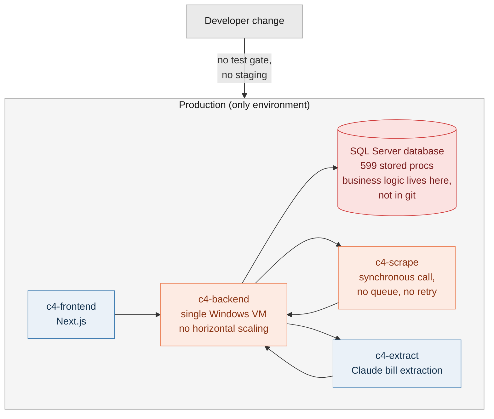
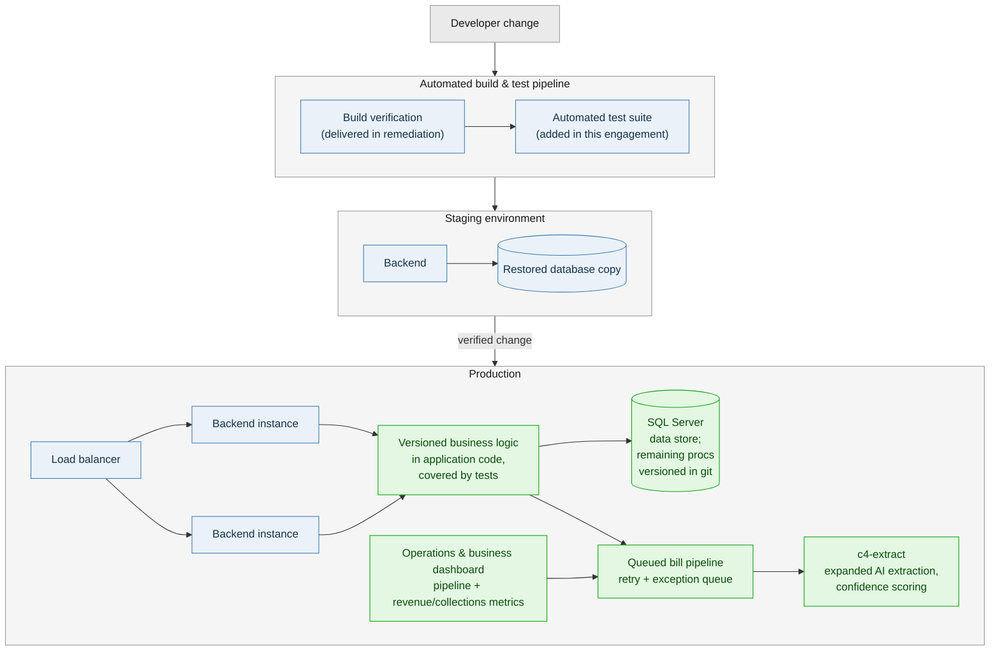
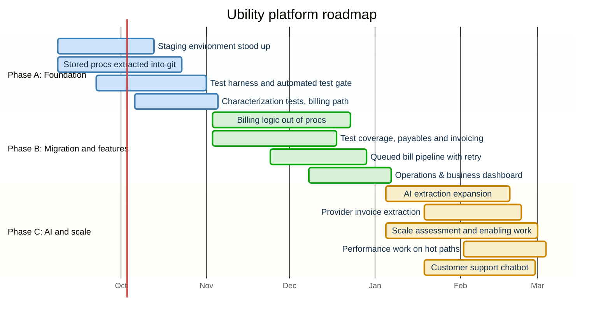

# Ubility: Ongoing Engineering Partnership

*Proposal for a six-month platform roadmap and continuing engineering ownership, following the security remediation engagement currently underway.*

---

## Executive summary

### The situation

Ubility has a working product with real customers, real revenue, and real third-party integrations, and it has stayed stable for months with nobody actively maintaining it. That is a credit to the original build, not evidence it is safe to grow. **All of the platform's core business logic, the rules that decide what a resident owes, lives in 599 stored procedures inside the live production database, not in version control.** There is no history of who changed what, no way to review a change before it ships, and no way to test one outside production, the single largest constraint on the platform today. Keystone has already built a full inventory of all 599: [ubility-stored-procedures.md](../ubility-stored-procedures.md). <!-- TODO (Google Docs): relative link won't resolve outside this repo, so attach the file separately or swap in a real URL. --> There is **no staging environment**, so every change ships straight to production, and **no automated test coverage** beyond confirming the code compiles. The backend is **a single Windows VM with no horizontal scaling path**, and there is **no visibility into the business itself**: no dashboard for revenue, collections, or property performance, only for whether the servers are up. The one person who understood this system end to end is gone, and it has been without a maintainer for months. Every additional month in that condition is a month where a database incident, a bad manual deploy, or a misunderstood billing rule has no safety net underneath it.

### The proposal

Keystone is proposing a fixed-scope roadmap, six months at the outside, that turns this platform into something a team can safely change, test, and grow, not just keep alive: a staging environment and real test coverage first, then the highest-risk business logic moved out of the database into reviewable, tested code, the business-visibility tools Ubility has been asking for, and an expansion of the AI extraction already running in production, including a customer-facing support chatbot, alongside a costed plan for real horizontal scale.

**Keystone has already ramped up on this codebase**: we've done a full audit of all six repositories, the original security report has been independently verified and corrected, and all 599 stored procedures are already inventoried, so none of that ramp-up gets billed here. The engineers doing the work have built production systems at Stripe, Microsoft, and Amazon and every conversation is directly with the person doing the work, with no account layer in between. 

**Pricing is to the outcome, not the hour**, so the incentive on both sides is the same: get it done well, and get it done fast. And unlike the alternative Ubility is weighing, **nothing here locks Ubility in**: the code and infrastructure stay in Ubility's own accounts throughout, so this platform stays just as easy to hand to another firm, or bring in-house, as it is to keep working with Keystone.

We are committed to a long-term partnership that is earned by the quality of the work, not by making it expensive to leave. At the end of six months, we will sit down together and decide what comes next, rather than assuming it by default.

---

## What kind of relationship this is

The goal is a long-term partnership, not a single project. The roadmap, the pricing, and how support is handled below are all built on that assumption.

That goal is also why this proposal does not lock Ubility in. A relationship that only survives because leaving costs more than staying isn't really a partnership. Keystone would rather earn next month's work than make this month's work expensive to walk away from. The Portability section later in this document covers exactly how that gets built in, not just promised.

At the end of these six months, the plan is to sit down together, look at what Ubility actually needs from there, and decide the path forward, rather than assume it by default. The goal is the long-term partnership itself, not just this six months of it.

---

## Continuity first

Before any roadmap work starts, the platform has to keep running. That is the base layer of this engagement, not a separate line item.

- **Nothing moves.** Ubility stays on its current AWS infrastructure. No hosting migration is required, requested, or implied by this proposal. Changing where the platform runs at the same time as changing how it is built would compound risk for no benefit.
- **Production support is included, not billed separately.** Bugs, incidents, integration failures, and customer-reported issues are handled inside the monthly engagement. There is no separate support contract, and no incentive on our side to classify work one way or the other.
- **The deploy pipeline built during remediation is the mechanism.** Every change reaches production through a known, repeatable pipeline tied to a specific commit, rather than a manual copy from someone's machine.
- **Snapshots before every deploy** continue until the staging environment exists, at which point staging replaces them as the primary safety net.
- **Existing behavior is preserved by default.** Where business logic moves out of a stored procedure, the target is identical output for identical input, verified by tests written against the current behavior before anything is changed. Migration is not an excuse to redesign.

Keystone has already read all six repositories, verified the security findings line by line, and produced the system architecture map. There is no ramp-up period being billed here.

---

## How we work

### Communications

- **A direct line to the people doing the work.** A shared channel connects Ubility staff to the Keystone team directly, not a ticket queue that has to escalate before anyone who actually knows the codebase sees it. The team monitors it together, so one person being unreachable does not leave Ubility without a way to reach someone.
- **Automated detection, not waiting for a customer to notice first.** Uptime and health checks against the backend, frontend, and bill-processing pipeline, wired into an alerting tool (PagerDuty or incident.io, whichever fits the budget better) that pages the Keystone team directly the moment something fails, rather than relying on a customer complaint or someone happening to check. Set up on the free or low-cost tier of whichever tool is chosen, since monitoring at Ubility's current scale does not need an enterprise incident platform.
- **Response times, tiered by what's actually broken:**

| Severity | What it looks like | Response |
|---|---|---|
| Critical | Production down, billing calculating wrong, a security issue, anything resident- or revenue-impacting | Automated alert fires immediately. Acknowledged within 1 hour during business hours, within 4 hours outside business hours, worked until resolved or mitigated. |
| High | A specific feature or integration broken, a workaround exists | Acknowledged by the next business day |
| Standard | A bug, a small request, a question that isn't blocking day-to-day operation | Handled in the normal weekly cadence alongside roadmap work |

- **A self-serve client portal, coming soon.** Keystone is building a client portal, included in this partnership at no additional cost, not something that turns into a paid add-on later. Anyone on Ubility's side of this, not just one point of contact, will be able to get their own account with access to see what work is actually happening, leave comments, ask questions, and follow progress in real time, rather than waiting on the monthly written summary. It also carries read-only contract and invoice status. It is on track to be ready soon and comes online automatically the moment it is. It is a side benefit of working with Keystone, not the reason to.

---

## How this is priced

Keystone Systems prices to the outcome. There is no hourly rate in this proposal and no time tracking. That is a structural position, not a preference.

Hourly billing and dedicated-headcount billing both price the same thing: attendance. Under either model, the vendor is paid more for taking longer, and the client's only lever is to audit the timesheet. Every hour spent recording, categorizing, and reviewing hours is overhead that both sides pay for and neither side gets value from. Worse, it puts the estimation risk on the buyer. If a piece of work turns out to be three times harder than expected, an hourly engagement invoices three times as much and calls it accurate.

Outcome pricing inverts that. The roadmap below is a named list of deliverables at a fixed price. If the stored-procedure migration on the billing path takes twice as long as estimated, that is Keystone's problem to absorb, not a change order. The incentive on our side is to find the shortest correct path to each deliverable, which is the same thing Ubility wants.

The tradeoff is that outcome pricing only works if the outcome is specific. That is why this document itemizes the work by phase and by deliverable instead of quoting a number of hours per week.

---

## Current state and target state

### Where the platform is today

<!-- For Google Docs: use diagram-current-state.png in this same directory instead of the mermaid source below, since Docs does not render mermaid natively. -->

Single environment, single backend instance, and the business rules that decide what a resident owes are stored in a place that cannot be reviewed, versioned, or tested.

### Where it lands in six months

<!-- For Google Docs: use diagram-target-state.png in this same directory instead of the mermaid source below, since Docs does not render mermaid natively. -->

One important clarification on scope: the horizontally scaled production topology above is delivered in this engagement as the enabling work (packaging the backend so it can run as multiple identical copies, externalizing its configuration, making session state independent of any one instance, and a costed cutover plan with a recommended target). The cutover itself is sequenced by that plan rather than assumed to finish inside the six months, because doing it correctly depends on what the assessment finds. Everything else in the target diagram is committed roadmap scope.

---

## The six-month roadmap

<!-- For Google Docs: use diagram-roadmap-gantt.png in this same directory instead of the mermaid source below, since Docs does not render mermaid natively. -->

Dates assume a start as the remediation engagement completes. They shift together if the start shifts.

The durations above already include buffer against the unexpected, not a best-case timeline assuming nothing goes wrong. If a phase lands ahead of it, the next one starts early rather than waiting out the calendar, so finishing faster than planned shortens the roadmap itself, not just this estimate of it.

### Phase A, months 1 and 2: a system that can be changed safely

Nothing else on this roadmap is safe to do until this exists.

| # | Deliverable | Why it is first |
|---|---|---|
| 1 | **Staging environment.** A second backend instance and a database restored from the existing daily backup, wired into the deploy pipeline built during remediation. Changes land here before production. | Removes the assumed-risk clause from the remediation contract. Today there is no place to try anything. |
| 2 | **Every stored procedure extracted into version control.** All 599 procs scripted out of the production database into versioned migration files in git, with the deploy pipeline applying them. No logic is rewritten in this step. | Core business logic currently exists in exactly one place: the live production database. If that instance is lost, the rules for what a resident owes are lost with it. This step alone removes the largest single point of failure on the platform. |
| 3 | **Automated test harness and test gate.** A test project wired into the existing build pipeline so that failing tests block a deploy, upgrading the build-verification step from remediation into an actual correctness check. | The remediation contract explicitly scoped a test suite out. This is where that gap gets closed. |
| 4 | **Characterization tests over the billing calculation path.** Tests written against current behavior, on the highest-traffic path first, so that current output is pinned down before any logic moves. | Migration without a behavioral baseline is a guess. This is what makes Phase B a safe operation instead of a risky one. |
| 5 | **A written migration plan for the remaining procedures**, ordered by traffic and risk, with each one classified as move, keep, or retire, building on the [initial inventory](../ubility-stored-procedures.md) already done. | Turns 599 procedures from an unbounded problem into a prioritized, finite list Ubility can track progress against. |

### Phase B, months 3 and 4: logic out of the database, first new capability

| # | Deliverable | Why it matters |
|---|---|---|
| 6 | **Resident billing and invoice generation logic moved from stored procedures into versioned application code**, covered by the tests from item 4, with the procedures retired or reduced to thin wrappers. | This is the highest-traffic, highest-consequence path in the product. Once it is in code, a change to how a bill is calculated can be reviewed, tested, and rolled back. |
| 7 | **Test coverage extended to provider invoice processing and payables**, the second cluster of business-critical logic. | These paths touch money moving outward. Same argument as item 6, applied in priority order. |
| 8 | **The bill-processing pipeline moved to a queued model with retry and an exception queue.** Today the backend calls the scraper synchronously and waits. A failed utility-portal login or a failed extraction has no automatic retry and no place to surface for a human. | Turns silent failures into visible, actionable work items. This is both a reliability fix and an operations fix: someone in operations can see what needs attention without an engineer reading logs. |
| 9 | **Operations and business metrics dashboard.** Two layers in one place: pipeline visibility (bills in flight, failed scrapes by utility provider, extractions awaiting review, unmatched bills, with retry and reassign actions) and business metrics (revenue billed versus collected, delinquency and collections aging by property, provider cost trends, bill exception rates, AI extraction cost and accuracy). | Direct answer to wanting better tools to manage the business, and to the observability gap named at the start of this document. Right now nobody at Ubility can see revenue or collections trends without asking an engineer to pull them by hand. |
| 10 | **A second round of feature work, selected with the team at the start of Phase B** from Ubility's own backlog and priorities, sized to the remaining capacity in these two months. | The roadmap should not assume we know Ubility's product priorities better than Ubility does. This slot is deliberately reserved and scoped jointly. |

### Phase C, months 5 and 6: AI capability and scale

| # | Deliverable | Why it matters |
|---|---|---|
| 11 | **AI bill extraction expanded.** The existing Claude integration in `c4-extract` gets broader utility-provider and bill-format coverage, per-field confidence scoring, and automatic routing of low-confidence extractions into the exception queue from item 8 instead of into the ledger. | This is an existing, working foundation, not a new capability being invented. The gap today is that extraction results are trusted or not trusted with no gradient, and there is nowhere for a doubtful result to go. |
| 12 | **AI extraction applied to provider invoices**, reusing the same pipeline against the payables side rather than only resident utility bills. | Same machinery, a second revenue-relevant workflow, and meaningfully less manual data entry. |
| 13 | **Natural-language query over billing and operational data**, including the metrics layer from item 9, for admin staff, scoped to read-only reporting against the data model, so a staff member can ask a question without an engineer writing a report. | Second half of the better-tools ask: instead of only a fixed dashboard, staff can ask a specific question directly. Deliberately scoped read-only. |
| 14 | **Scale assessment and enabling work.** Packaging the backend so it can run as multiple identical copies instead of one, in a way that is not tied to AWS specifically, so a future move to Azure or another major cloud stays possible rather than locking Ubility further into one provider. Also externalizing its configuration, making session state independent of any single copy, plus a written assessment with a recommended target setup, a cost comparison, and a sequenced cutover plan. This new version of the backend gets built and proven in the staging environment from Phase A first; only once it holds up there does a production copy get stood up and traffic cut over to it, rather than changing the live Windows VM in place. | The current single Windows VM has no horizontal scaling path. This phase makes the backend capable of running as more than one instance and produces the plan for actually doing it, with real numbers attached. |
| 15 | **Performance work on the paths surfaced by the assessment**, now measurable because the logic is in code and covered by tests. | Optimizing stored procedures nobody can test is guesswork. By month 5, it is not. |
| 16 | **Customer-facing support chatbot**, built on the same Claude integration already running in production, answering common billing and account questions directly (balance, due date, payment history, how a charge was calculated), with a clear handoff to a person for anything it cannot answer with confidence. | Turns AI capability the end customer never sees today into something they interact with directly, and is a fast, visible result once the underlying data is trustworthy from the earlier phases. |

Every item above traces back to a specific finding in the security audit or the system architecture map already delivered, or a direct ask from Ubility's team. None of it is generic modernization work.

---

## How AI is incorporated

Two separate answers, because they are two separate things.

**In the product.** Ubility already runs Claude in production through `c4-extract` for utility bill extraction. That is a real foundation and the reason the AI items on this roadmap are extensions rather than experiments, not new capability being invented from scratch. The roadmap expands it along the axes that actually reduce manual work and directly touch the end customer: more bill formats, confidence scoring so uncertain results are routed to a human instead of silently accepted, the same pipeline applied to provider invoices, natural-language reporting for admin staff, and a customer-facing support chatbot answering common billing and account questions directly. The constraint we hold to is the same across all of it: AI output touching billing data, or an answer given directly to a customer, is either verified by a deterministic check or handed off to a person, never written straight to the ledger or stated to a customer on confidence alone.

**One thing we don't yet know, and will confirm early.** The Anthropic (Claude) API key currently in production is a single, shared credential, but where it actually comes from is not confirmed from the repos alone: whose account it is billed to, what usage limits it runs under, and whether it is still tied to the prior engineer personally rather than a Ubility-owned account. That last possibility deserves the same treatment as the other credentials already being rotated in the remediation work: a key tied to a person who is no longer here is a real operational risk, not just an administrative detail. Confirming ownership, and moving it to a Ubility-owned account if needed, happens early rather than being left as an assumption.

**Cost is worth a second look alongside correctness.** The service already tracks estimated spend on every extraction, which is a useful thing to already have. Once the key's ownership is confirmed, the same roadmap work is a natural point to check whether the current setup is the cheapest way to get the same accuracy: not paying to re-send the same instructions on every single call, processing work that isn't time-sensitive in a cheaper batch mode instead of paying for an instant answer every time, and confirming the more expensive AI model is only used where a cheaper one genuinely cannot do the job, not by default. Nothing here is a committed savings number, just a real lever worth checking once the current baseline is confirmed.

**In how the work gets done.** Keystone uses AI tooling heavily in its own engineering process, which is part of why two senior engineers can commit to this volume of work. The stored-procedure migration in particular is high-volume mechanical translation with high consequence for getting it wrong, which is exactly the shape of work where tooling handles the volume and senior review handles the judgment. That leverage is why this is offered as a fixed roadmap rather than an open-ended hours arrangement. It is not the reason to hire Keystone, and it does not replace the tests, the staging environment, or the review that catch the cases where the tooling is confidently wrong.

---

## Who does the work

The Keystone team working on this engagement has been through the full six-repository audit, the independent verification of the security review, and the architecture mapping.

That team has built production systems where getting it wrong is not an option. Tanner was an individual contributor on Stripe's core payments infrastructure and a Principal Engineer at Microsoft. Alex was an individual contributor on the software that manages Amazon's satellite fleet, and has led individual projects there. That same discipline applied to a platform this size looks like a bill calculated correctly and a change that does not take the platform down.

Keystone maintains a small network of equally experienced independent engineers who are brought in when a piece of work calls for surge capacity or specific expertise. Engagements stay founder-scoped: Tanner scopes the work and decides who is looped in.

The practical point is coverage. A single-engineer arrangement, whether that engineer is a contractor or a full-time hire, reproduces the exact situation Ubility is recovering from now.

---

## Pricing

Two structures for the same roadmap. The work, the deliverables, and the phase sequencing are identical. The difference is the commitment shape.

### Option 1: Fixed roadmap price, invoiced monthly

The entire six-month roadmap quoted as one total, invoiced in six equal installments.

| Phase | Months | Committed scope |
|---|---|---|
| Phase A | 1 to 2 | Staging environment, stored procedures into version control, test harness and automated test gate, characterization tests on the billing path, migration plan |
| Phase B | 3 to 4 | Billing logic migrated out of stored procedures, test coverage on payables and invoicing, queued bill pipeline with retry and exception handling, operations and business metrics dashboard, jointly scoped feature slot |
| Phase C | 5 to 6 | AI extraction expansion with confidence scoring, provider invoice extraction, natural-language reporting, customer-facing support chatbot, scale assessment and enabling work, performance work |

Invoiced at **$17,000 per month for six months** ($102,000 total). Production support, incident response, and the weekly check-in are included throughout at no additional charge.

This option prices the outcome of the full roadmap rather than a month of availability. Both sides commit to the six months, and Ubility gets a lower total in exchange for that commitment.

### Option 2: Monthly retainer

| Item | Price |
|---|---|
| Ongoing engineering partnership | **$18,000 per month** |
| Minimum initial term | 3 months |
| After the initial term | Month to month, 30 days notice |

Same roadmap, same phase sequence, same included production support. Ubility can stop after any month past the initial term without owing the balance of the roadmap. Over a full six months this comes to $108,000, a $6,000 premium over Option 1, which is the price of that flexibility.

### Option 3: Maintenance-only, once the foundation is in place

Not available starting today, and deliberately so: the platform isn't in a state where hands-off maintenance is safe until the roadmap's foundational work is done. Once it is, this becomes a real, lower-cost path if Ubility wants to shift from active development to just keeping things running.

| Item | Price |
|---|---|
| Maintenance and support, no active development | **$6,000 per month** |
| Minimum term | 3 months |
| After the initial term | Month to month, 30 days notice |

This covers production support, incident response, and the same monitoring and response times described earlier, plus ongoing security hygiene, but does not carry a committed development scope the way Options 1 and 2 do. It is the right fit if the six-month roadmap gets Ubility to where it needs to be and active feature work should pause, not the right fit if new development is still wanted, in which case Option 2 stays available on the same terms. This is one concrete version of the conversation described above about revisiting scope together at the end of the six months, not the only one.

### Capacity reserved for whatever matters most

Under either option, the named deliverables above are scoped to roughly four fifths of each month's capacity. The remaining fifth is deliberately not assigned to anything specific, so there is real, unscoped capacity available for whatever turns out to matter most: a production incident, a bug a resident reports, feedback on work in progress, a problem that was not visible when this roadmap was written. Nothing in that reserve gets scoped or billed unless it is actually needed, and if a given month doesn't need it, that capacity goes straight into moving the roadmap forward instead of sitting unused. That is why a production issue in week two does not push a roadmap deliverable into the next month, and why an unexpected request does not require a change order.

This is also where fixed-outcome pricing pays off in a way hourly billing never does. If a phase finishes ahead of schedule, Ubility isn't paying for idle time, and Keystone isn't waiting around for more to bill. Both sides want the same thing: the roadmap done well, and done as fast as that allows.

None of this works as a way to quietly stretch deliverables out. The capacity needed to hit each roadmap commitment is reserved first, always; the fifth described above is what's left over, not a pool to borrow against. If other work in a given month frees up more time than expected, that time goes toward delivering value for Ubility sooner, not toward finding a reason to wait.

Work that falls genuinely outside the roadmap (a new integration with a property-management system not already connected, the scale cutover itself once the plan is approved, a database platform migration) is flagged and scoped before anything is started, never billed after the fact.

---

## Portability: Ubility keeps control of who maintains this

This is a stated goal of the engagement, not a side effect of it. When the six months are over, Ubility should be able to hand this platform to any competent engineer or firm and have them be productive on it. That includes handing it to someone other than Keystone.

**Everything stays on infrastructure Ubility owns.** The code stays in Ubility's own repositories. The platform stays in Ubility's own AWS account, under Ubility's own billing relationship, with Ubility holding root access. Keystone works inside those accounts rather than moving anything into a Keystone-controlled environment. There is nothing in this proposal that Ubility would have to migrate off of in order to stop working with Keystone.

**The modernization work is what creates the portability, and it's the same list of what stays behind as a durable asset regardless of how long this engagement runs.** This is worth being explicit about, because the two goals are the same goal:

| Roadmap item | What it does for portability |
|---|---|
| Stored procedures extracted into version control | A new engineer can read the business rules in git instead of having to be granted production database access and reverse-engineer them |
| Business logic moved into application code with tests | The rules become reviewable and verifiable by someone who was not here when they were written |
| Staging environment | A new engineer can learn the system by trying things, without their learning curve running through production |
| Automated test suite | A new engineer finds out they broke something from the automated tests rather than from a customer |
| Architecture and system documentation kept current | The knowledge exists in a document instead of in one person's head |
| Packaging the backend so it can run as multiple identical copies, with its configuration externalized | The application can be stood up somewhere else by someone else, rather than being tied to one hand-configured machine |
| Operations and business metrics dashboard | Whoever runs this platform next can see what's happening in it without asking an engineer to pull a report by hand |
| Costed, sequenced scale plan | Usable whether Keystone executes it or someone else does |

Handoff is the default posture at Keystone. Everything above is built so that Ubility, or whoever Ubility hires next, is not dependent on us to keep it running.

**Two decisions, not one.** Who maintains this platform and where it runs are separate questions. They do not need the same answer. An offer that bundles them together, like the hosting-bundled arrangement under consideration, makes leaving expensive by design: if that relationship ever changes, for any reason, Ubility is looking at an infrastructure migration on top of finding new engineering help, at the exact moment it has the least capacity to absorb either. This proposal keeps the two decoupled on purpose. Ubility can change engineering partners without touching infrastructure, and can change infrastructure without touching the engineering relationship, because neither one is a condition of the other.

Leaving the platform as it is today has the same shape of problem for a different reason: undocumented business logic living only in a production database means whoever touches it next has leverage over Ubility, whether that is Keystone or anyone else. Ubility's negotiating position with every future engineer is set by how legible the platform is.

**This works whether Ubility ever leaves unhappy or simply outgrows needing outside help.** If Ubility scales the way this roadmap is built to support, at some point it may make more sense to bring engineering in-house entirely, and that is not a failure of this engagement, it is what success looks like. Because the code and infrastructure stay in Ubility's own accounts and the business logic lives in reviewable, tested application code rather than in anyone's head, that transition is exactly as clean as the one described above.

**The test to hold this proposal to:** at any point during or after this engagement, could Ubility hand these repositories and this AWS account to a new firm and have them productive without Keystone's cooperation? If the answer is yes, the work is doing what it should. That is the state this roadmap is built to reach.

---

## On the alternative under consideration

Ubility is weighing this against a dedicated junior engineer bundled with a hosting migration. That is a legitimate option and worth comparing on the substance rather than on price alone.

| | Dedicated junior headcount | This proposal |
|---|---|---|
| **What is priced** | One person's time in seat, monthly | A named roadmap of deliverables |
| **Who carries estimation risk** | Ubility. Work taking longer costs more months. | Keystone. The roadmap price is fixed. |
| **Starting knowledge** | Begins at zero on six repositories with no documentation, no tests, and a sole author who is gone | Full six-repository audit complete, security review independently verified and corrected, architecture map delivered, remediation in progress |
| **Hosting** | Migration to the vendor's platform required | No change today, and the same roadmap work also makes a future move to Azure or another major cloud possible if Ubility ever wants it, not just staying put on AWS. |
| **Infrastructure foundation** | Vendor's own data centers, two facilities, both in Utah | Hyperscale cloud (AWS today; Azure or another major provider remains Ubility's option), built for national scale regardless of who maintains the application on top of it |
| **Seniority applied** | Execution capacity | Senior judgment on the decisions that are expensive to reverse, applied to a platform where those decisions are pending |
| **Who you're talking to** | Routed through the vendor's own account and management structure | The people actually building it, directly, every time |
| **Continuity** | One assigned person doing the day-to-day work. If they move on, whoever replaces them has to ramp up on this codebase from the same starting point Ubility is at today. | Two engineers already ramped up on this codebase, with a network available for surge capacity |
| **Cost of ending the relationship** | An infrastructure migration off the vendor's platform, on top of finding new engineering help | Nothing to migrate. Code and infrastructure stay in Ubility's own accounts throughout. |
| **Effect on future options** | Ubility becomes more dependent on one vendor over time | Ubility becomes handoff-ready to any firm over time (see the portability section above) |

Worth spelling out beyond the table: the dedicated-headcount offer moves Ubility onto that vendor's own two data centers, both in Utah, not a hyperscale cloud provider. That may not matter for day-to-day stability, but if the goal is to scale nationwide, that infrastructure choice is as much a scale decision as who's doing the engineering.

Keystone is built to stay lean on purpose. The people running the firm are the same people writing the code, not an account or management layer sitting on top of a separate delivery team. There is no information lost in translation between whoever Ubility talks to and whoever does the work, and no question that has to travel up a chain to get answered. Every conversation is with the builder.

Put simply: if what Ubility needs is a steady volume of smaller fixes handled and the hosting move works for the business, dedicated junior headcount is a reasonable way to get that. The difference shows up earlier than that, in deciding which of the 599 stored procedures move first, which stay as they are, and in what order, so a resident's bill doesn't come out wrong along the way. Those are exactly the decisions Phase A is built around, and they benefit from senior judgment from the start.

---

## Next step

A working session to confirm three things: which pricing structure fits how Ubility wants to commit, whether the Phase B feature slot should be pre-committed to specific items from Ubility's backlog now or scoped at the phase boundary, and whether Residence Billing has a stake in this given their interest in Ubility continuing as their billing platform.

Once direction is agreed, this becomes a contract with the same structure as the remediation agreement: itemized scope, fixed price, stated terms.
